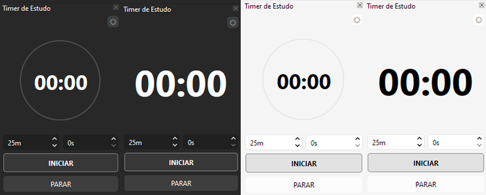
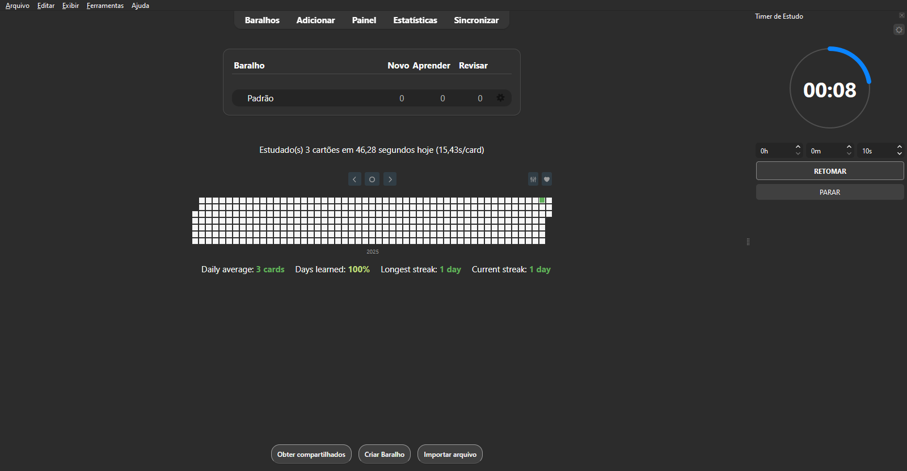
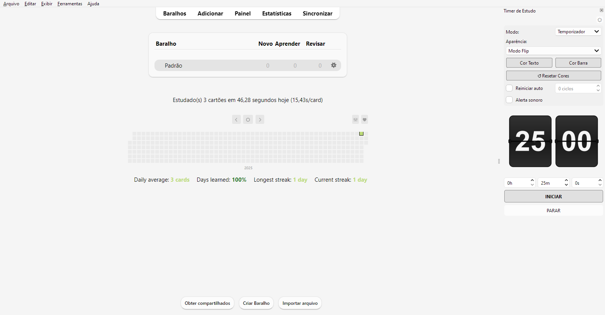

# Study Timer Dock para Anki

> Um cronômetro de estudos discreto e integrado nativamente na interface do Anki.

O Study Timer Dock foi projetado para estudantes que utilizam técnicas de produtividade (como Pomodoro ou Timeboxing) e desejam manter o foco sem alternar janelas. Ele reside na lateral da janela de revisão como um painel nativo.

---

  

  <em>Diferentes modos de aparência do Timer</em>

---

  

  <em>Visualização do Timer no Anki em modo Dark</em>

---

  

  <em>Visualização do Timer no Anki em modo White</em>

---

## Funcionalidades Principais

* **Integração Nativa:** Funciona como uma barra lateral (Dock) fixa. Pode ser fechada, aberta ou movida sem cobrir os cartões.
* **Design Responsivo:**
    * **Modo Circular:** Visualização gráfica do progresso.
    * **Modo Foco:** Interface minimalista numérica.
    * **Modo Linear:** Interface gráfica de progresso em linha.
    * **Modo Flip:** Interface com placas.
    * **Dark Mode Automático:** Ajusta as cores instantaneamente conforme o tema do Anki.
* **Configurações Persistentes:** O addon salva suas preferências automaticamente (tempo, modo de visualização, configurações de som).
* **Foco:**
    * Botão de configurações discreto.
    * Interface limpa.
* **Produtividade:**
    * **Alerta Sonoro:** Opção de aviso sonoro ao finalizar.
    * **Loop Automático:** Opção para reiniciar o ciclo automaticamente.
    * **Loop Automático com contagem:** Opção para reiniciar o ciclo automaticamente e parar depois de um número de ciclos determinado.

## Instalação

### Via AnkiWeb
1. Abra o Anki e vá em **Ferramentas** > **Extensões**.
2. Clique em **Obter Extensões**.
3. Insira o código: `(CÓDIGO DO ANKI WEB AINDA NÃO DISPONÍVEL)` e clique em OK.
4. Reinicie o Anki.

### Instalação Manual (GitHub)
1. Baixe a versão mais recente na aba [Releases](https://github.com/matheusaraujoc/anki-timer/releases).
[Download Direto](https://github.com/matheusaraujoc/anki-timer/releases/download/v1.0.0/Study.Timer.ankiaddon)
2. Abra o Anki e vá em **Ferramentas** > **Extensões**.
2. Clique em **Instalar de um arquivo**.
4. Selecione o arquivo que você baixou.
3. Reinicie o Anki.

## Guia de Uso

### 1. Ativando o Timer
Vá no menu superior: **Ferramentas** -> **Timer de Estudo**.

### 2. Controles
* Defina os **Minutos**, **Segundos** ou **Horas** na parte inferior.
* Clique em **INICIAR** para começar a contagem.
* O botão mudará para **PAUSAR** e **RETOMAR** conforme necessário.
* **PARAR** reseta o tempo para o total inicial.

### 3. Ajustes
No canto superior direito do painel do timer tem o ícone de configurações (⛭). Clique para configurar:

* **Aparência:** Alterne entre o visual Gráfico ou Texto.
* **Reiniciar auto:** O timer recomeça automaticamente ao chegar em zero.
* **Alerta sonoro:** Toca um aviso do sistema ao fim do tempo.

## Tecnologias

Desenvolvido em **Python 3** utilizando **PyQt6** (via `aqt`).
* Renderização vetorial com `QPainter`.
* Hooks do sistema para reatividade de temas.
* Gerenciamento de configuração via JSON.

## Autor

**Matheus Araújo**  
Desenvolvedor de software e Estudante de Ciência da Computação. 
E-mail: mscarvalho0523@gmail.com  
GitHub: github.com/matheusaraujoc

## Licença

Distribuído sob a licença MIT. Veja o arquivo LICENSE para mais informações.